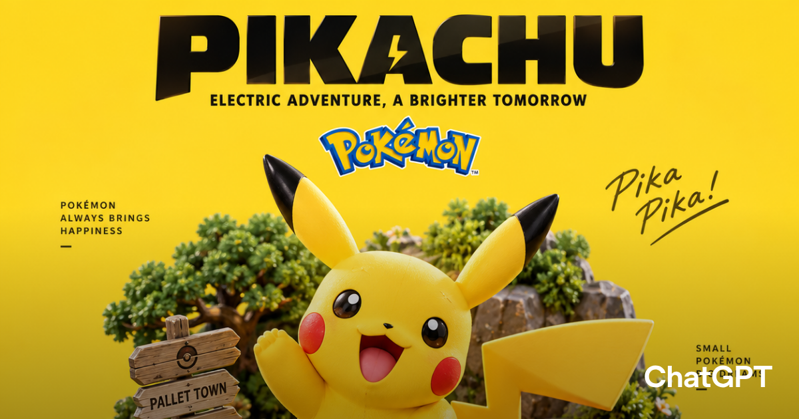

# 载具微缩图 · Vehicle Diorama

[](./LICENSE)
[](./SKILL.md)

一个 **Codex / ChatGPT 技能**：把任意经典载具、机器人、动漫角色或 IP 主题，一键生成 **45° 俯视等距视角的收藏级 3D 微缩场景海报**。

## 这是什么

输入一个主体（比如 `AE86`、`蝙蝠车`、`千年隼号`、`皮卡丘`），技能会把它：

- 做成一个**高端收藏级 3D 微缩模型**——PBR 材质、细腻倒角、合理金属反射、电影级棚拍灯光；
- 放在一个有厚度、带倒角的**立体底座**上，底座自动匹配它最经典的世界观（赛道 / 车库 / 太空基地 / 森林对战场…）；
- 配上**干净的纯色背景** + 顶部大标题 + 一句副标题；
- 输出一张居中、**1:1、1080×1080** 的商业海报质感成品图。

## 效果示例

| 皮卡丘 · 电系冒险微缩场景 |
|:---:|
|  |

> 更多示例见 [`examples/`](./examples/)。

## 特性

- ✅ 只输入一个「主体」就能出图，其余细节（场景 / 背景色 / 副标题）自动推断
- ✅ 三种主体解析模式：真实载具 / 虚构机械 / 角色·品牌·非载具 IP（自动设计成主题载具）
- ✅ 45° 等距俯视 + 完整底座 + 纯色背景 + 1:1 方形构图
- ✅ 严格的正负面质量约束（PBR、无渐变、无乱码文字、无水印）

## 快速开始

### 在 Codex 中使用

```bash
git clone https://github.com/NealAi/vehicle-diorama-skill.git
```

把仓库放到你的 Codex skills 目录，说「**载具微缩图**」或要求把某个载具/IP 做成微缩海报时，技能会自动触发。

### 在 ChatGPT 中使用

把 [`SKILL.md`](./SKILL.md) 的指令内容贴进一个自定义 GPT，或直接复制下面的「独立提示词模板」到对话里。

## 输入变量

| 变量 | 必填 | 说明 | 默认 |
|------|:---:|------|------|
| `subject` 主体 | ✅ | 载具 / 机械 / 机器人 / 角色 / 品牌 / IP | — |
| `scene` 场景 | — | 最有识别度的环境 | 按世界观自动推断 |
| `background_color` 背景色 | — | 单一纯色 | 按主体自动选对比色 |
| `title` 标题 | — | 顶部大标题 | 主体名 |
| `subtitle` 副标题 | — | 8–16 字描述 | 自动生成 |

## 示例提示词

```
用载具微缩图做一张 AE86，秋名山，深灰背景。
生成皮卡丘载具微缩图，其他细节你自动决定。
把蝙蝠车做成黑色收藏级微缩场景海报。
只给我一份可复制的载具微缩图提示词，不要生成图片。
```

## 独立可复制的提示词模板

想不用技能、直接复制下面这段到任意图像生成工具（ChatGPT / Midjourney / 即梦等），把 `{{ }}` 里的变量替换掉即可：

```text
呈现一个清晰精致的 45° 俯视等距视角 3D 微缩收藏场景，主题为 {{主体名称}}。
将 {{主体名称}} 设计为整个画面的绝对视觉中心，在保留其最具辨识度的外形、配色、比例和经典视觉特征的基础上，转化为高端收藏级 3D 模型质感。
主体放置于一个小型、抬高、有厚度的立体微缩场景底座之上。
根据 {{主体名称}} 所属的经典世界观，自动设计最具代表性的环境场景。例如载具可匹配道路、赛车场、海洋、天空、太空、车库、军事基地等；角色或机器人则匹配其具有代表性的城市、森林、房间、基地、战斗场景或其他经典环境。
在底座中加入少量能够强化世界观的微缩细节，例如路牌、树木、建筑、工具箱、路灯、护栏、轮胎、岩石、机械设备、家具或微型人物，但所有辅助元素不得抢夺主体视觉焦点。
整体采用高端收藏模型 / Premium Collectible Diorama 视觉语言，使用精致柔和的表面纹理、真实 PBR 材质、细腻倒角、合理金属反射、塑料与橡胶材质区分，以及柔和电影级棚拍灯光。
模型具有真实实体收藏品的重量感、制造细节和高级玩具摄影质感，而不是普通卡通渲染。
背景使用干净的纯色 {{背景颜色}}，不使用渐变、复杂纹理或多余环境。
画面顶部居中显示大号粗体标题：“{{主体名称}}”。
标题下方显示一句简短副标题：“{{一句话描述}}”。
如适合，可在副标题下加入简洁的主题徽章或原创图形标识。
所有文字根据背景颜色自动选择黑色或白色，以保证最高可读性。
构图要求：主体严格居中，底座完整展示，45° 等距俯视视角，视觉层次清晰，大面积留白，商品级棚拍效果，收藏级模型质感，超高细节，高识别度。
画幅：1:1 方形，1080×1080。
```

## 仓库结构

```
vehicle-diorama-skill/
├── SKILL.md            # 技能主文件（Codex skill 定义）
├── agents/
│   └── openai.yaml     # ChatGPT / Codex 接入配置
├── assets/
│   └── icon.svg        # 技能图标
├── examples/           # 效果示例图
└── LICENSE
```

## License

[MIT](./LICENSE)
